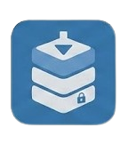
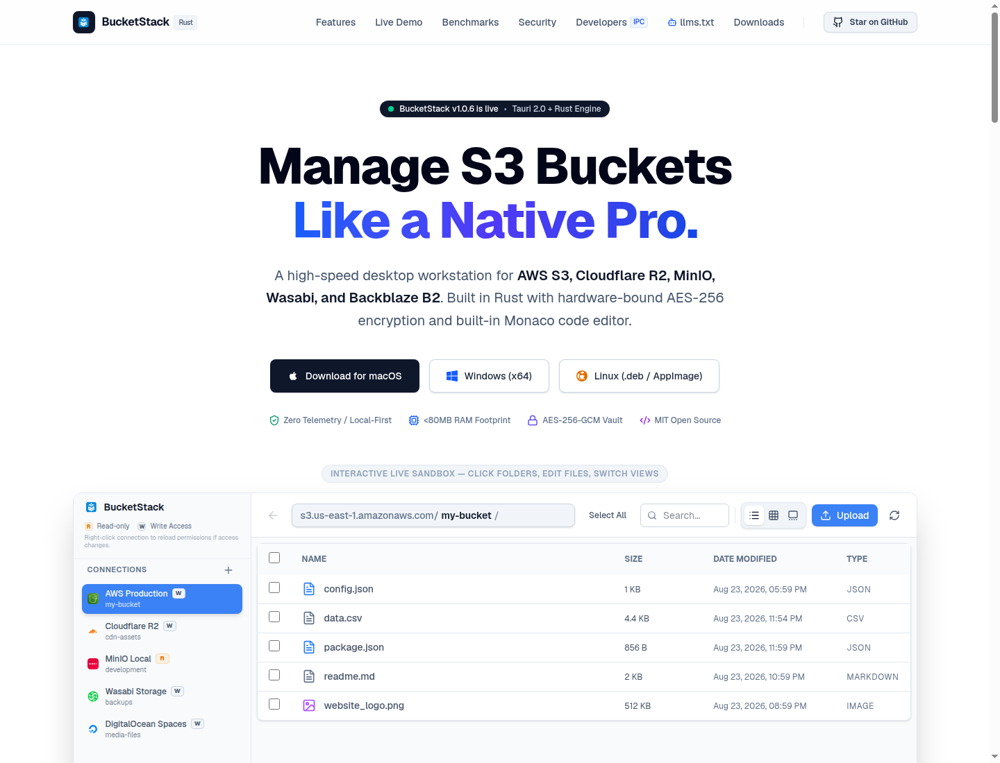
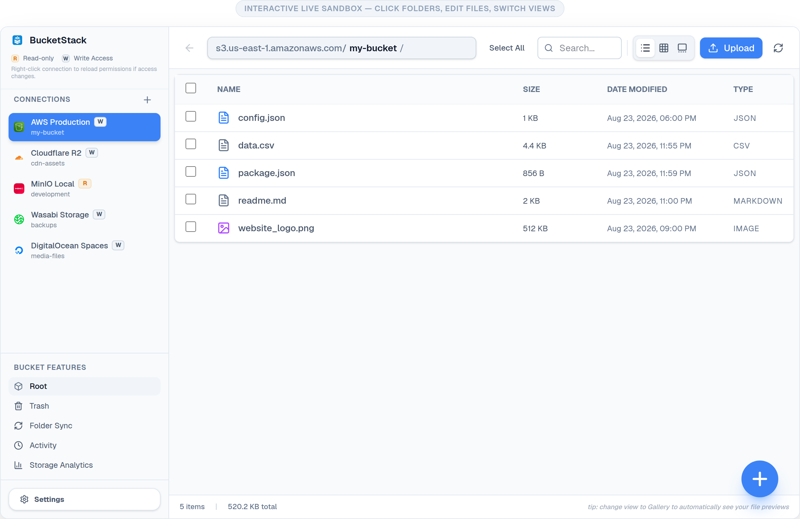
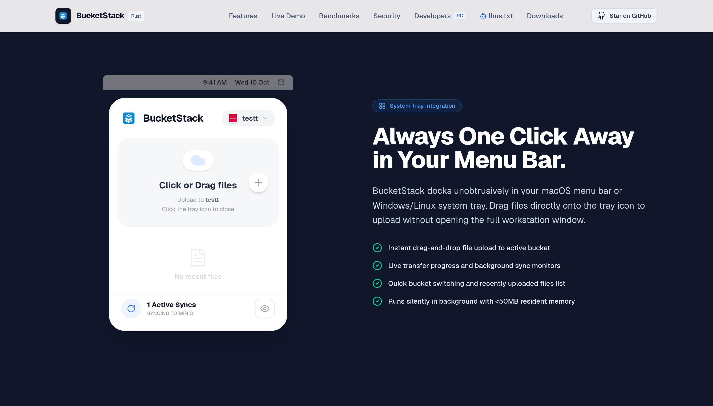
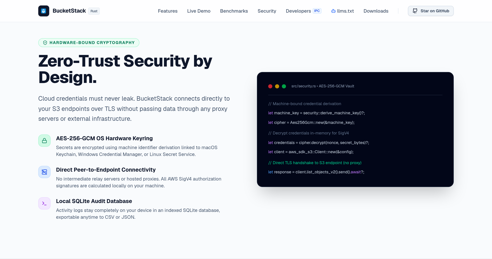

# BucketStack 🗂️

<div align="center">
  
  <br />
  <p><strong>A fast, secure, and native desktop S3 bucket workstation for macOS, Windows, and Linux.</strong></p>
  
  [](https://opensource.org/licenses/MIT)
  [](https://github.com/SaiAkashNeela/bucketstack/releases)
  [](https://github.com/SaiAkashNeela/bucketstack/releases)
  [](https://tauri.app)
  [](https://www.bucketstack.app/llms.txt)
</div>

---

<p align="center">
  
</p>

---

## 🌟 Overview

**BucketStack** is a native, local-first desktop workstation for managing S3-compatible object storage across multiple clouds. Built with **Tauri 2.0**, **React 19**, and **Rust**, it delivers blazing-fast desktop performance, negligible memory footprint (<80MB RAM), and hardware-bound AES-256-GCM encryption.

### ✨ Key Highlights

- ⚡ **Blazing Fast Rust Core**: Instant startup (&lt;1.5s) and low RAM usage powered by native Rust and Tauri 2.0.
- 🔐 **Hardware-Bound Zero-Trust Security**: Zero plaintext credentials. Keys are encrypted with AES-256-GCM hardware-bound to OS Keyring (macOS Keychain, Windows Credential Manager, Linux Secret Service).
- ☁️ **Universal Multi-Provider Support**: First-class support for **AWS S3, Cloudflare R2, MinIO, Wasabi, Backblaze B2, DigitalOcean Spaces**, and custom S3-compatible SigV4 endpoints.
- 📝 **In-Bucket Monaco Code Editor**: View, edit, and save JSON, YAML, configs, code, and markdown directly inside S3 with syntax highlighting for 50+ languages.
- 🔄 **Direct Cloud-to-Cloud Streaming**: Move or copy files between different S3 providers without writing intermediate files to local disk.
- 📱 **System Tray & Menu Bar App**: Instant drag-and-drop file upload directly to your menu bar or taskbar icon.
- 🗄️ **Local SQLite Audit Trail**: Searchable, exportable local audit log of every upload, delete, rename, and transfer.

---

## 📸 Interface & Capabilities

### 1. Interactive S3 Workstation & Multi-View Explorer
Manage buckets with List, Grid, macOS-style Column, and Media Gallery views. Perform inline code editing, bulk uploads, and search across objects.

<p align="center">
  
</p>

### 2. Menu Bar & System Tray Quick Access
Dock BucketStack in your system tray to monitor transfers, quick-switch accounts, and drop files for background uploading.

<p align="center">
  
</p>

### 3. Hardware-Bound Zero-Trust Security
Your keys never touch third-party servers. All AWS SigV4 signatures are calculated locally, with credentials protected by OS-level hardware encryption.

<p align="center">
  
</p>

---

## 🚀 Quick Start

### Prerequisites

- **Node.js** (v18+) or **Bun** (v1.0+)
- **Rust** (1.75+ with `cargo`)
- **OS Tools**: Xcode CLI (macOS), Visual Studio C++ Build Tools (Windows), or `libwebkit2gtk-4.1-dev` (Linux)

### Development

1. **Clone the repository**
   ```bash
   git clone https://github.com/SaiAkashNeela/bucketstack.git
   cd bucketstack
   ```

2. **Install dependencies**
   ```bash
   bun install
   # or: pnpm install / npm install
   ```

3. **Run desktop app in development mode**
   ```bash
   bun run tauri:dev
   ```

4. **Or run web UI only**
   ```bash
   bun run dev
   ```

---

## 📦 Download Binaries

Pre-built signed binaries for all platforms are available on [GitHub Releases](https://github.com/SaiAkashNeela/bucketstack/releases/latest):

| Platform | Format | Architecture |
| :--- | :--- | :--- |
| **macOS** | Universal `.dmg` / `.app.tar.gz` | Apple Silicon (M1/M2/M3/M4) & Intel (x86_64) |
| **Windows** | Setup `.exe` / `.msi` | 64-bit (x64) |
| **Linux** | `.AppImage`, `.deb`, `.rpm` | 64-bit (x86_64 / amd64) |

*In-app updates are cryptographically signed with Minisign and auto-prompt when a new release is available.*

---

## 🤖 AI Agents & Developer Integration

BucketStack publishes standardized machine-readable endpoints for AI agents and LLM tool-calling:

- **LLM Summary (`/llms.txt`)**: https://www.bucketstack.app/llms.txt
- **Complete Technical Context (`/llms-full.txt`)**: https://www.bucketstack.app/llms-full.txt
- **Developer Portal & IPC Reference**: https://www.bucketstack.app/developers

---

## 📄 License

BucketStack is free and open-source software licensed under the [MIT License](LICENSE.md).
